# @codecollab.co/neopop-rn

> NeoPop design system for React Native — every feature from CRED's iOS, Android, Web, and Flutter libraries unified into one Expo-compatible TypeScript package.

[](https://www.npmjs.com/package/@codecollab.co/neopop-rn)
[](./LICENSE)
[](https://github.com/codecollab-co/neopop-rn/actions)
[](https://codecov.io/gh/codecollab-co/neopop-rn)
[](https://codecollab-co.github.io/neopop-rn/)

> **v1.0 — stable API.** This release marks the first semver-guaranteed, production-ready version of neopop-rn. See the [Migration Guide](./docs/MIGRATION.md) if upgrading from v0.x.

---

## What is NeoPop?

NeoPop is CRED's "next generation of beautiful, affirmative design" — a 3D visual language built around multi-surface rendering, depth effects, shimmer animations, and tactile interactions. This library brings the complete NeoPop system to React Native and Expo, covering every component from all four original CRED repos.

---

## Demo

### NeoPopButton

#### Elevated Button

3D extruded button with depth — presses down into the surface on tap.

<p align="center">
  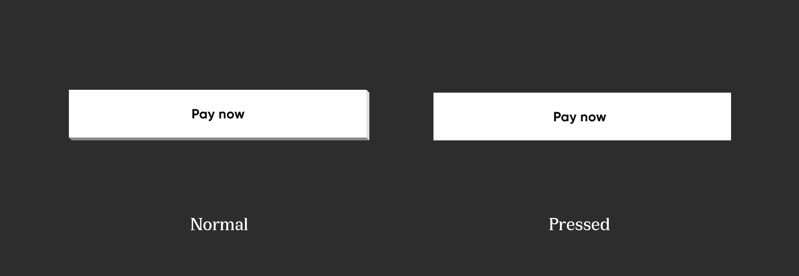
</p>
<p align="center">
  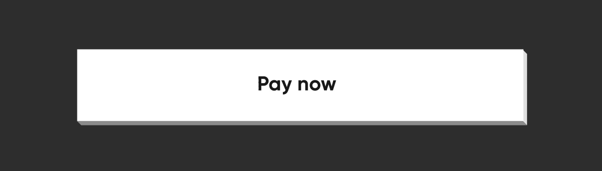
</p>

#### Flat Button

Flat 3D surface with subtle edge colors — compresses on press.

<p align="center">
  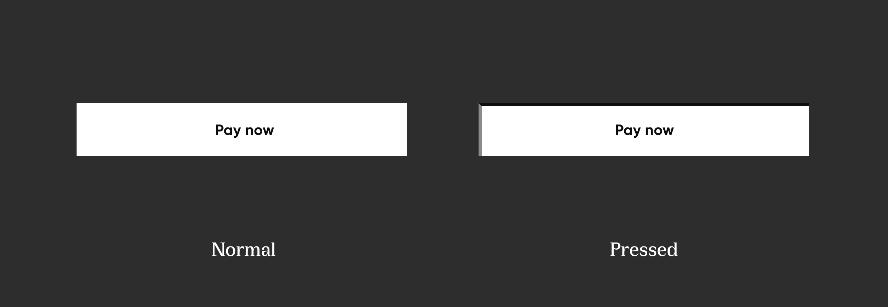
</p>
<p align="center">
  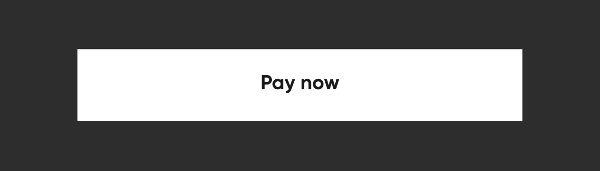
</p>

#### Flat Button with Strokes

Outlined variant with stroke borders — ideal for secondary actions on dark backgrounds.

<p align="center">
  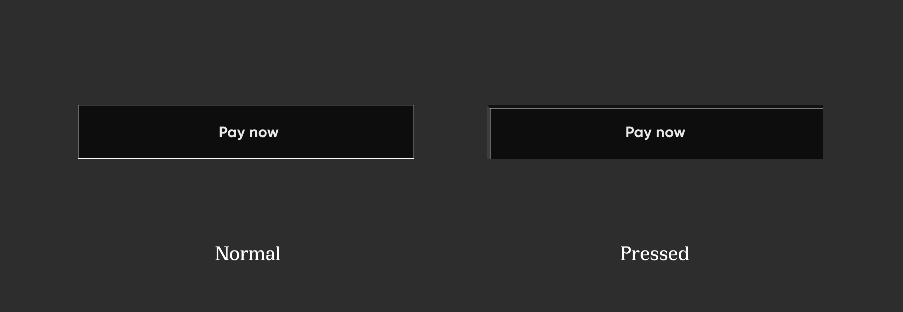
</p>
<p align="center">
  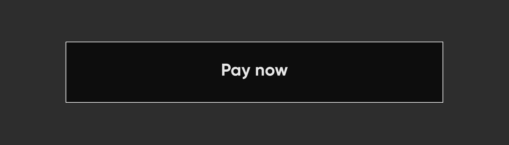
</p>

#### Adjacent Buttons

Buttons that share edges — vertical and horizontal arrangements with connected 3D surfaces.

<p align="center">
  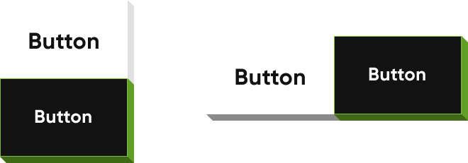
</p>
<p align="center">
  
  &nbsp;&nbsp;&nbsp;
  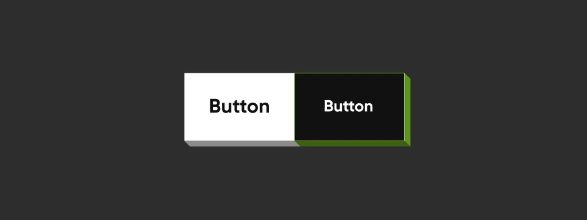
</p>

#### Surface Layout

The NeoPop 3D surface model — five faces (center, top, right, bottom, left) composited via Skia.

<p align="center">
  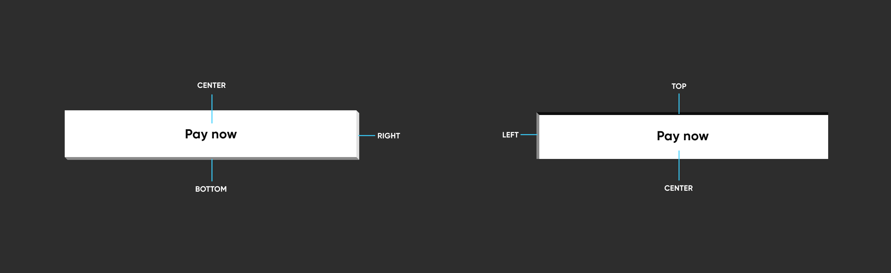
</p>

### NeoPopTiltedButton

#### Floating Tilted Button

Skewed parallelogram with shadow — floats above the surface and flattens on press.

<p align="center">
  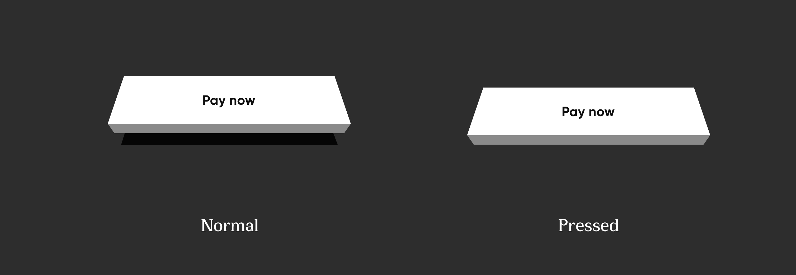
</p>
<p align="center">
  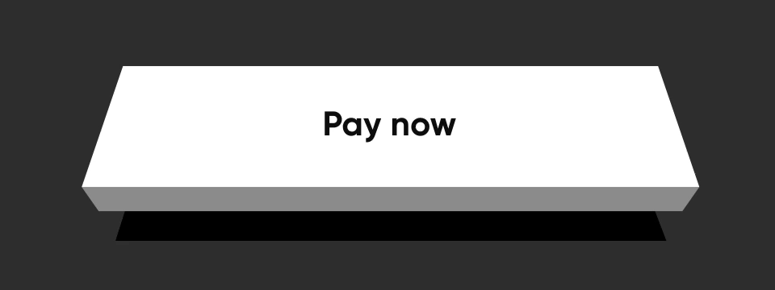
</p>

#### Non-Floating Tilted Button

Grounded parallelogram with 3D edge — compresses into the surface on press.

<p align="center">
  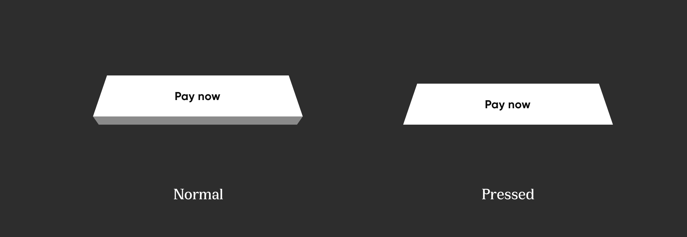
</p>
<p align="center">
  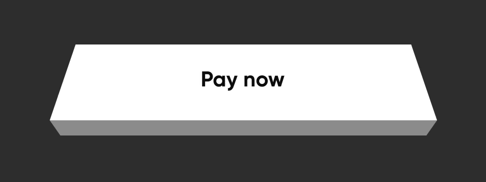
</p>

#### Tilted Button with Strokes

Outlined tilted variant with colored stroke edges.

<p align="center">
  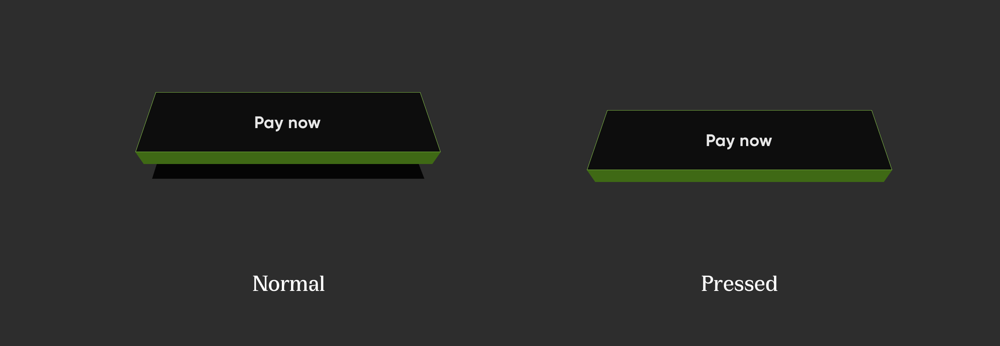
</p>
<p align="center">
  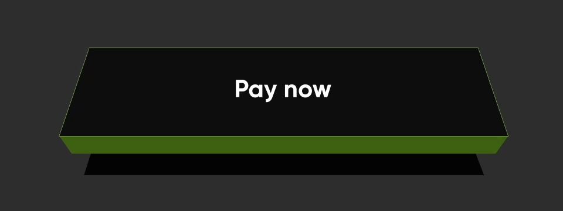
</p>

#### Tilted Button Layout

The tilted button surface model — center, bottom, and shadow layers.

<p align="center">
  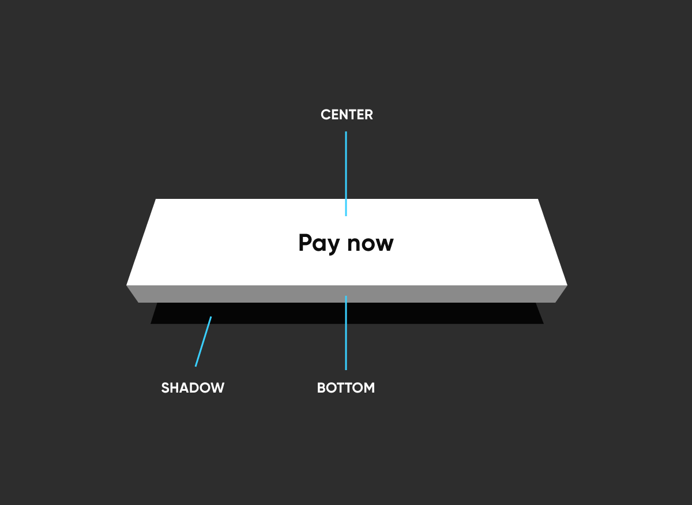
</p>

### NeoPopShimmer

Diagonal sweep shimmer effect — wraps any component for a loading or attention-drawing animation.

<p align="center">
  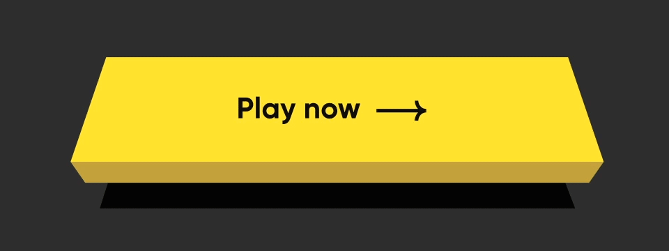
</p>

---

## Features

- **27 components** — buttons, form controls, navigation, feedback, display, and more
- **3D surfaces** — five-face model via Skia Canvas, crisp at any pixel density
- **Fluid animations** — Reanimated 3 on the UI thread, zero JS-thread jank
- **Shimmer effects** — standalone wrapper or built into any button
- **Full dark / light mode** — global provider + per-component override
- **Complete token system** — exported color palettes, spacing, typography scale
- **Web support** — same codebase works on iOS, Android, and web via Expo
- **Haptics** — opt-in per component via `expo-haptics`
- **Strict TypeScript** — every prop interface exported
- **WCAG 2.1 AA** — full accessibilityRole, accessibilityState, accessibilityValue coverage

---

## Installation

```bash
npm install @codecollab.co/neopop-rn
```

### Peer Dependencies

```bash
npx expo install \
  react-native-reanimated \
  react-native-gesture-handler \
  @shopify/react-native-skia \
  expo-haptics
```

| Peer Dependency | Version | Required |
|---|---|---|
| `react-native-reanimated` | `>=3.0.0` | Yes |
| `react-native-gesture-handler` | `>=2.0.0` | Yes |
| `@shopify/react-native-skia` | `>=1.0.0` | Yes |
| `expo-haptics` | `>=13.0.0` | Optional |

### Babel Plugin (Required)

Add the Reanimated plugin to your `babel.config.js` — it must be last:

```js
module.exports = function (api) {
  api.cache(true);
  return {
    presets: ['babel-preset-expo'],
    plugins: [
      'react-native-reanimated/plugin', // must be last
    ],
  };
};
```

---

## Setup

Wrap your app with `NeoPopProvider` and `GestureHandlerRootView`:

```tsx
// App.tsx
import React from 'react';
import { GestureHandlerRootView } from 'react-native-gesture-handler';
import { NeoPopProvider } from '@codecollab.co/neopop-rn';

export default function App() {
  return (
    <GestureHandlerRootView style={{ flex: 1 }}>
      <NeoPopProvider colorMode="dark">
        <RootNavigator />
      </NeoPopProvider>
    </GestureHandlerRootView>
  );
}
```

---

## Quick Start

```tsx
import {
  NeoPopButton, NeoPopTypography,
  FontType, FontWeight,
  ToastProvider, useToast,
} from '@codecollab.co/neopop-rn';

// 3D Button
<NeoPopButton
  variant="elevated"
  size="big"
  fullWidth
  colorConfig={{ color: '#ffffff' }}
  onPress={() => console.log('pressed')}
  enableHaptics
>
  <NeoPopTypography fontType={FontType.CAPS} fontWeight={FontWeight.BOLD} fontSize={14} color="#0d0d0d">
    PAY NOW
  </NeoPopTypography>
</NeoPopButton>

// Toast
const { addToast } = useToast();
addToast({ content: 'Payment successful!', type: 'success', autoCloseTime: 3000 });
```

---

## Components

### Buttons

| Component | Description | Docs |
|---|---|---|
| `NeoPopButton` | 3D extruded button with shimmer, adjacency, press animation | [NeoPopButton.md](./docs/components/NeoPopButton.md) |
| `NeoPopTiltedButton` | Skewed parallelogram button with optional floating animation | [NeoPopTiltedButton.md](./docs/components/NeoPopTiltedButton.md) |
| `NeoPopFloatingButton` | Levitating button with imperative ref API | [NeoPopFloatingButton.md](./docs/components/NeoPopFloatingButton.md) |
| `NeoPopCard` | Pressable 3D surface container | [NeoPopCard.md](./docs/components/NeoPopCard.md) |

### Form Controls

| Component | Description | Docs |
|---|---|---|
| `NeoPopCheckbox` | 3D checkbox with spring checkmark animation | [NeoPopCheckbox.md](./docs/components/NeoPopCheckbox.md) |
| `NeoPopRadio` | Radio button with spring dot animation | [NeoPopRadio.md](./docs/components/NeoPopRadio.md) |
| `NeoPopToggle` | Animated pill toggle with haptics | [NeoPopToggle.md](./docs/components/NeoPopToggle.md) |
| `NeoPopInputField` | Animated border text input with label, error, char count | [NeoPopInputField.md](./docs/components/NeoPopInputField.md) |
| `NeoPopDropdown` | Pressable dropdown trigger with chevron rotation | [NeoPopDropdown.md](./docs/components/NeoPopDropdown.md) |
| `NeoPopSlider` | Pan-gesture slider with step snapping and haptics | [NeoPopSlider.md](./docs/components/NeoPopSlider.md) |
| `NeoPopStepper` | Increment/decrement control with spring label animation | [NeoPopStepper.md](./docs/components/NeoPopStepper.md) |
| `NeoPopOTPInput` | Multi-box OTP/PIN entry with auto-advance | [NeoPopOTPInput.md](./docs/components/NeoPopOTPInput.md) |
| `NeoPopDatePicker` | Three-column FlatList scroll wheels (Day/Month/Year) | [NeoPopDatePicker.md](./docs/components/NeoPopDatePicker.md) |

### Navigation & Layout

| Component | Description | Docs |
|---|---|---|
| `NeoPopBottomSheet` | Gesture-driven bottom sheet with imperative ref API | [NeoPopBottomSheet.md](./docs/components/NeoPopBottomSheet.md) |
| `NeoPopHeader` | Page header with back arrow, title, description | [NeoPopHeader.md](./docs/components/NeoPopHeader.md) |
| `NeoPopBack` | Back navigation row with westward Chevron | [NeoPopBack.md](./docs/components/NeoPopBack.md) |
| `Row` / `Column` / `PageContainer` | Flexbox layout helpers | [Row.md](./docs/components/Row.md) |

### Feedback & Display

| Component | Description | Docs |
|---|---|---|
| `NeoPopToast` | Spring-animated toast with swipe-to-dismiss | [NeoPopToast.md](./docs/components/NeoPopToast.md) |
| `NeoPopTags` | Semantic pill/badge with type colors | [NeoPopTags.md](./docs/components/NeoPopTags.md) |
| `NeoPopProgressBar` | Horizontal and circular Skia arc variants | [NeoPopProgressBar.md](./docs/components/NeoPopProgressBar.md) |
| `NeoPopAccordion` | Spring expand/collapse with animated chevron | [NeoPopAccordion.md](./docs/components/NeoPopAccordion.md) |
| `NeoPopCarousel` | Pan-gesture carousel with imperative ref API | [NeoPopCarousel.md](./docs/components/NeoPopCarousel.md) |
| `NeoPopSwipeRow` | Swipeable list row with left/right action panels | [NeoPopSwipeRow.md](./docs/components/NeoPopSwipeRow.md) |

### Primitives

| Component | Description | Docs |
|---|---|---|
| `NeoPopShimmer` | Diagonal sweep shimmer wrapper | [NeoPopShimmer.md](./docs/components/NeoPopShimmer.md) |
| `NeoPopTypography` | Full font system with FontType × FontWeight | [NeoPopTypography.md](./docs/components/NeoPopTypography.md) |
| `Chevron` / `Cross` / `Pointer` | Skia-rendered icon primitives | [Chevron.md](./docs/components/Chevron.md) |

---

## Documentation

Full documentation is available at **[codecollab-co.github.io/neopop-rn](https://codecollab-co.github.io/neopop-rn/)**.

| Guide | Description |
|---|---|
| [Getting Started](https://codecollab-co.github.io/neopop-rn/docs/getting-started) | Installation, setup, quick examples |
| [THEMING.md](./docs/THEMING.md) | NeoPopProvider, mergeDeep system, dark/light themes, colorConfig deep-dive |
| [TOKENS.md](./docs/TOKENS.md) | All color, spacing, typography, opacity, and button tokens |
| [CONTRIBUTING.md](./docs/CONTRIBUTING.md) | Dev setup, commit conventions, PR checklist, how to add a component |
| [MIGRATION.md](./docs/MIGRATION.md) | v0.x → v1.0 migration guide, deprecated props, removed exports |

### Design Token Exports

Tokens from `src/primitives/` are exported in four platform formats via [Style Dictionary](./token-build/):

| Format | Output file |
|---|---|
| CSS custom properties | `tokens/css/variables.css` |
| Figma Tokens JSON | `tokens/figma/tokens.json` |
| Android resources | `tokens/android/colors.xml`, `tokens/android/dimens.xml` |
| iOS Swift constants | `tokens/ios/NeoPopTokens.swift` |

Regenerate with `npm run tokens` (requires `cd token-build && npm install` once).

---

## Theming

```tsx
<NeoPopProvider
  colorMode="dark"
  theme={{
    button: {
      color: '#06C270',
      edgeColors: { bottom: '#04A05C', right: '#059E5A' },
    },
  }}
>
  <App />
</NeoPopProvider>
```

See [docs/THEMING.md](./docs/THEMING.md) for the full guide.

---

## Design Tokens

```tsx
import {
  POP_BLACK, POP_WHITE,
  SEMANTIC_SUCCESS, SEMANTIC_ERROR,
  SPACING_MD, SPACING_LG,
  FontType, FontWeight,
  DISABLED_OPACITY,
} from '@codecollab.co/neopop-rn';
```

See [docs/TOKENS.md](./docs/TOKENS.md) for the complete token reference.

---

## Platform Support

| Platform | Support | Notes |
|---|---|---|
| iOS | ✅ Full | All 27 components |
| Android | ✅ Full | All 27 components |
| Web (Expo) | ✅ Full | Skia via WASM |

---

## Performance

All animated components run on the **UI thread** via Reanimated 3 worklets — zero JS bridge calls during animations, even at 60 FPS.

| Metric | Value |
|--------|-------|
| Animated components | 18 / 27 use Reanimated worklets |
| Skia canvas components | 8 (NeoPop3DSurface, TiltedButton, ScoreMeter, ProgressBar circular, Chevron, Cross, Pointer) |
| JS thread work per frame | < 1 ms |
| Full library size (ESM, gzip) | < 50 KB (peer deps excluded) |
| `sideEffects` | `false` — fully tree-shakeable |

See [`perf/BENCHMARKS.md`](./perf/BENCHMARKS.md) for the full benchmark report.

---

## Contributing

See [docs/CONTRIBUTING.md](./docs/CONTRIBUTING.md) for the full contributor guide.

Quick start:
```bash
git clone https://github.com/codecollab-co/neopop-rn.git
cd neopop-rn
npm install --legacy-peer-deps
npm run typecheck && npm run lint && npm test
```

---

## License

[Apache 2.0](./LICENSE)

---

## Acknowledgements

Built on top of CRED's original NeoPop design system:
- [neopop-ios](https://github.com/CRED-CLUB/neopop-ios)
- [neopop-android](https://github.com/CRED-CLUB/neopop-android)
- [neopop-web](https://github.com/CRED-CLUB/neopop-web)
- [neopop-flutter](https://github.com/CRED-CLUB/neopop-flutter)
